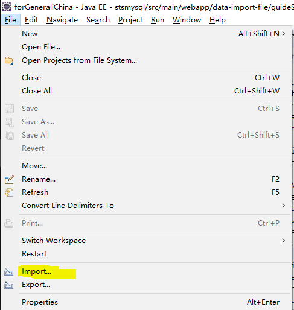
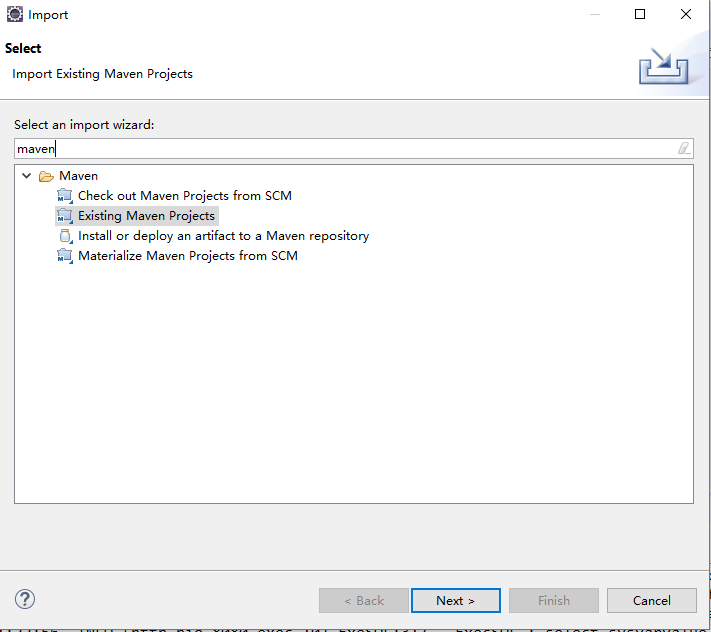
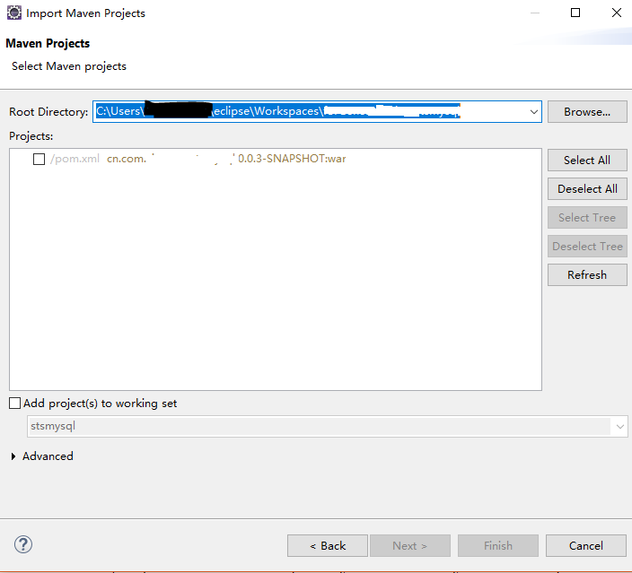
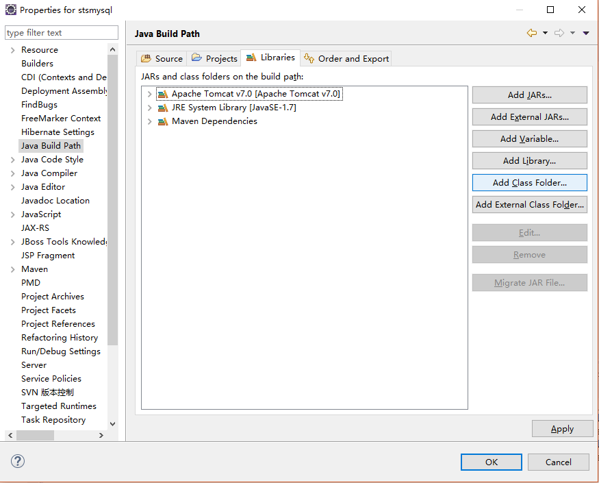
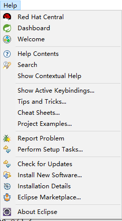
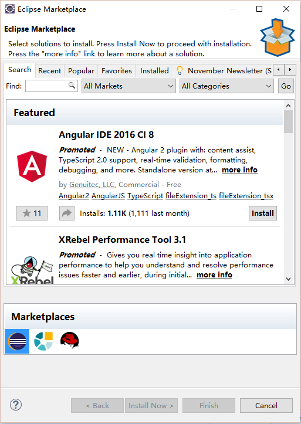

# Eclipse EE Neon.1 (4.6.1) 使用说明

## 下载 `Eclipse`
* eclipse 是开源免费软件，可到[eclipse 官网](https://eclipse.org/) 处获取到下载链接地址。
* eclipse 有两种方式下载，直接下载独立安装的ZIP程序包，或者使用 `Eclipse Installer` 进行在线安装.
* eclipse 下载页面地址：[https://eclipse.org/downloads/eclipse-packages/](https://eclipse.org/downloads/eclipse-packages/)


## Eclipse 安装、启动，注意事项

eclipse 是免安装程序,直接将zip包解压即可，然后双击 `eclipse.exe` 即可使用

>需要注意的是 `eclipse 4.6` 版本需要 JDK 1.8。若系统环境变量 `JAVA_HOME`有配置指定到jdk1.8，那么eclipse直接可用。 <br/>

另外，也可以在 `eclipse.ini` 文件中配置eclispe 所使用的jdk,可在 `--launcher.appendVmargs` 之后 `-vmargs`之前增加如下参数，参数值为安装的jdk bin目录路径

```ini
-vm
C:/Program Files/Java/jdk1.8.0_101/bin
```

## 导入 Maven 项目

1. 如下所示点击"File-Import"<br/>


2. 选择导入Existing Maven Projects<br/>


3. 选择源码路径,然后点击`Finish`<br/>


## Eclipse 设置Build Path



## Eclispe 插件安装

### 通过 Eclipse Marketplace 在线安装

依次进行如下操作：

1. `help` - `Eclipse Marketplace...`<br/>

2. 搜索选择插件，install安装 <br/>


### 通过 `Software Sites` URL 在线安装

点击 "help" -- > "Install New Software" 打开安装界面，并在 `Work with` 框中输入插件的`Update site URL` 地址。


### 离线安装

1. 将插件下载解压，删除`features`与`plugins` 之外的所有文件，然后将此两文件夹放入一个新建的名为`eclispe` 的文件夹里，然后将这个eclipse文件夹放入以插件名为名的文件夹。然后进行下一步。
2. 将插件文件放置到 `eclipse\dropins\`目录下，*`最终第一步解压的两个插件文件将会位于形如{eclipse根目录}\dropins\Subclipse-1.10.13-1.9.x\eclipse`的路径下* 重启eclipse即可


## Eclipse常用插件列表

*以下插件可通过`Eclipse Marketplace`搜索到，然后安装 *

* Subclipse
  *`Subversion` 插件*
* JBoss Tools
  *提供集成JBoss Application Server，Hibernate, 查看与编辑 `properties`、`xml` 、`web.xml`文件，等功能*
* Spring Suite Tool
  *开发Spring 相关功能*
* Buildship Gradle Integration
  *集成 `Gradle`*
* MyBatispse
  *MyBatis 开发插件*
* Mybatis Generator
  *为eclipse提供自动生成MyBatis相关代码的功能*
